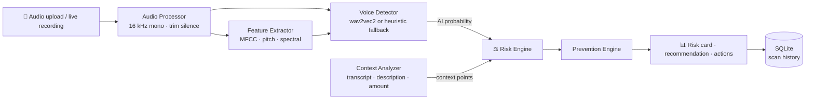

<div align="center">

# 🛡️ VoiceShield AI

### Real-Time Voice Cloning Detection & Impersonation Prevention

*Detect AI-generated voices, flag scam behaviour, and get clear guidance on what to do next.*

<p>
  
  
  
  
  
  
</p>

<p>
  
  
  
</p>

</div>

---

## 📖 About

Voice cloning tools can now copy a person's voice from just a few seconds of audio. Scammers use this to pose as a boss, a relative, a bank officer or a government official and pressure victims into sharing OTPs or sending money.

**VoiceShield AI** was built for a **Smart India Hackathon** problem statement. It analyses a call recording (uploaded or recorded live in the browser) and combines **three signals** into one easy-to-read risk score:

| Signal | What it checks |
|---|---|
| 🎙️ **Voice authenticity** | Is the voice human or AI-generated? |
| 💬 **Conversation context** | Urgency, OTP requests, impersonation claims, money requests |
| 💰 **Transaction amount** | Is a large payment involved? |

It then tells the user exactly what to do, for example *"Hang up and call back on a verified number."*

---

## ✨ Features

- 🔐 **Secure authentication**: register and log in with JWT tokens and bcrypt-hashed passwords
- 📁 **Upload or record live**: supports `.wav`, `.mp3`, `.m4a`, `.flac`, `.ogg`, `.webm` (max 20 MB, 1–60 seconds of speech)
- 🤖 **Deepfake voice detection**: pretrained wav2vec2 model with an automatic heuristic fallback
- 🧠 **Scam-context analysis**: rule-based detection of urgency, OTP/PIN requests, confidential-info requests, money transfers and impersonation claims
- 📊 **Transparent risk engine**: a 0–100 score mapped to `LOW`, `MEDIUM`, `HIGH` or `CRITICAL`
- 🚨 **Prevention guidance**: plain-language recommendations and action steps per risk level
- 📈 **Dashboard**: total scans, real vs AI voices, risk distribution charts and average risk
- 🕑 **Scan history**: review or delete past scans
- 📝 **Security logging**: login, failed login, scan and high-risk events are recorded
- 🔒 **Privacy first**: uploaded audio is deleted right after processing, and only the analysis results are stored

---

## 🏗️ How It Works



### Risk score formula

```
Risk Score = (AI probability × 0.65) + Context points (max 30) + Historical points (max 5, reserved)
```

| Score | Level | Meaning |
|:---:|:---:|---|
| 0 – 25 | 🟢 **LOW** | Looks safe; continue normal verification |
| 26 – 50 | 🟡 **MEDIUM** | Proceed carefully and verify the caller |
| 51 – 75 | 🟠 **HIGH** | Possible impersonation; do not share sensitive info |
| 76 – 100 | 🔴 **CRITICAL** | Likely AI voice or scam; stop and verify independently |

> **About the detector:** `get_voice_detector()` first tries to load the pretrained
> [`MelodyMachine/Deepfake-audio-detection-V2`](https://huggingface.co/MelodyMachine/Deepfake-audio-detection-V2)
> wav2vec2 model (downloaded from Hugging Face on first use). If the model can't be loaded (no internet, no `torch`, low memory), the app automatically falls back to a **transparent rule-based baseline detector** so it keeps working.
> The baseline is a heuristic and **has not been validated on a labelled dataset**, so don't treat its output as production-grade accuracy. Override the model with the `VOICE_MODEL_ID` environment variable.

---

## 🧰 Tech Stack

| Layer | Technologies |
|---|---|
| **Frontend** | React 19, Vite, React Router, Tailwind CSS, Axios, Recharts |
| **Backend** | FastAPI, Uvicorn, SQLAlchemy, Pydantic |
| **Auth** | JWT (python-jose), bcrypt (passlib) |
| **Audio / ML** | librosa, soundfile, NumPy, SciPy, scikit-learn, PyTorch, Hugging Face Transformers |
| **Database** | SQLite |
| **Deployment** | Vercel config included for the frontend |

---

## 📂 Project Structure

```
voicesheild-ai/
├── backend/
│   ├── app/
│   │   ├── main.py                  # FastAPI app, CORS, routers, health check
│   │   ├── api/
│   │   │   ├── auth.py              # register / login / me
│   │   │   ├── analysis.py          # audio upload + full detection pipeline
│   │   │   ├── history.py           # list / view / delete scans
│   │   │   └── dashboard.py         # aggregate statistics
│   │   ├── core/                    # settings (.env) and JWT / password security
│   │   ├── database/                # SQLAlchemy engine and models (User, Scan, SecurityLog)
│   │   ├── schemas/                 # Pydantic request / response models
│   │   ├── services/
│   │   │   ├── audio_processor.py   # load, mono, resample, trim, validate
│   │   │   ├── feature_extractor.py # MFCC, mel-spectrogram, pitch, spectral features
│   │   │   ├── voice_detector.py    # ML detector + heuristic fallback
│   │   │   ├── context_analyzer.py  # scam-indicator rules
│   │   │   ├── risk_engine.py       # score and level calculation
│   │   │   └── prevention_engine.py # recommendations and actions
│   │   └── utils/                   # temp-file helpers
│   ├── requirements.txt
│   ├── .env.example
│   └── test_audio.wav               # sample audio for testing
└── frontend/
    ├── src/
    │   ├── pages/                   # Login, Register, Dashboard, Analyze, History
    │   ├── components/              # Navbar, Sidebar, RiskCard, AudioRecorder, AudioUploader
    │   └── services/api.js          # Axios client with JWT interceptor
    ├── package.json
    └── vercel.json
```

---

## 🚀 Getting Started

### Prerequisites

- **Python 3.10+**
- **Node.js 18+** and npm
- *(Optional)* an internet connection on first run to download the wav2vec2 model (~400 MB)

### 1️⃣ Clone the repository

```bash
git clone https://github.com/<your-username>/voicesheild-ai.git
cd voicesheild-ai
```

### 2️⃣ Start the backend

```bash
cd backend

# create and activate a virtual environment
python -m venv venv
venv\Scripts\activate            # Windows
# source venv/bin/activate       # macOS / Linux

# install dependencies
pip install -r requirements.txt

# create your environment file
copy .env.example .env           # Windows
# cp .env.example .env           # macOS / Linux
```

Open `.env` and set a strong `SECRET_KEY`. You can generate one with:

```bash
python -c "import secrets; print(secrets.token_hex(32))"
```

Then start the server:

```bash
uvicorn app.main:app --port 8000
```

- API: http://127.0.0.1:8000
- Interactive docs (Swagger): http://127.0.0.1:8000/docs
- Health check: http://127.0.0.1:8000/api/health

> 💡 The first analysis request loads the ML model, so it may take longer than later ones.
> Without `torch` installed, the app still runs using the baseline detector.

### 3️⃣ Start the frontend

Open a **second terminal**:

```bash
cd frontend
npm install
npm run dev
```

Open **http://localhost:5173**, create an account and start analysing.

---

## ⚙️ Configuration

**Backend**: `backend/.env`

| Variable | Default | Description |
|---|---|---|
| `SECRET_KEY` | `changeme_...` | JWT signing key. **Change this!** |
| `ALGORITHM` | `HS256` | JWT algorithm |
| `ACCESS_TOKEN_EXPIRE_MINUTES` | `60` | Token lifetime |
| `DATABASE_URL` | `sqlite:///./voiceshield.db` | Database connection string |
| `ENVIRONMENT` | `development` | Environment label |
| `CORS_ORIGINS` | `http://localhost:5173` | Comma-separated allowed frontend origins |
| `VOICE_MODEL_ID` | `MelodyMachine/Deepfake-audio-detection-V2` | *(optional)* Hugging Face model to use |

**Frontend**: optional `frontend/.env`

| Variable | Default | Description |
|---|---|---|
| `VITE_API_URL` | `http://127.0.0.1:8000` | Backend base URL |

---

## 🔌 API Reference

All endpoints except register, login and health require the header `Authorization: Bearer <token>`.

| Method | Endpoint | Description |
|:---:|---|---|
| `POST` | `/api/auth/register` | Create an account |
| `POST` | `/api/auth/login` | Log in and receive a JWT |
| `GET` | `/api/auth/me` | Get the current user |
| `POST` | `/api/analyze/upload` | Analyse an audio file (multipart form) |
| `GET` | `/api/history` | List your scans, newest first |
| `GET` | `/api/history/{scan_id}` | Get one scan's details |
| `DELETE` | `/api/history/{scan_id}` | Delete a scan |
| `GET` | `/api/dashboard/stats` | Aggregate statistics |
| `GET` | `/api/health` | Service health check |

**Example: analyse a recording**

```bash
curl -X POST http://127.0.0.1:8000/api/analyze/upload \
  -H "Authorization: Bearer <token>" \
  -F "file=@backend/test_audio.wav" \
  -F "transcript=This is your bank calling, urgent, please share the OTP immediately" \
  -F "transaction_amount=50000"
```

**Example response**

```json
{
  "scan_id": 1,
  "filename": "test_audio.wav",
  "human_probability": 5.0,
  "ai_probability": 95.0,
  "authenticity_score": 5.0,
  "risk_score": 82.8,
  "risk_level": "CRITICAL",
  "indicators": [
    "Suspicious urgency detected",
    "OTP/verification code request detected",
    "Moderate transaction amount flagged (₹50,000)"
  ],
  "recommendation": "High probability of AI-generated or impersonated voice. Stop sensitive actions and independently verify the person's identity through a separate, trusted channel immediately.",
  "actions": [
    "Do NOT share any sensitive information.",
    "Do NOT proceed with any payment, transfer, or account action.",
    "End the call/interaction and verify independently.",
    "Consider reporting the incident if a scam is confirmed."
  ]
}
```

---

## 🔒 Privacy & Security

- Raw audio is written to a **temporary file** and **always deleted** after processing, even if an error occurs.
- Only derived metadata (scores, indicators, recommendation) is stored in the database.
- Passwords are hashed with **bcrypt**; sessions use short-lived **JWT** tokens.
- Every scan is scoped to the logged-in user, so nobody can read or delete another user's history.
- The system gives **advice only**. It never takes irreversible actions automatically.

---

## 🗺️ Roadmap

- [ ] Train and evaluate a custom deepfake-voice model on a labelled dataset
- [ ] Automatic speech-to-text so the transcript is filled in for the user
- [ ] NLP / LLM-based context analysis to replace the keyword rules
- [ ] Real-time streaming analysis during live calls
- [ ] Historical risk signals, for example repeated risky callers
- [ ] Multi-language support (Hindi and other regional languages)
- [ ] Docker setup and cloud deployment guide

---

## 🤝 Contributing

Contributions are welcome!

1. Fork the repo
2. Create a feature branch: `git checkout -b feature/amazing-feature`
3. Commit your changes: `git commit -m "Add amazing feature"`
4. Push the branch: `git push origin feature/amazing-feature`
5. Open a Pull Request

---

## ⚠️ Disclaimer

VoiceShield AI is a hackathon prototype. Detection results are probabilistic and can be wrong. Always verify a caller's identity through an independent, trusted channel before sharing sensitive information or making payments.

---

<div align="center">

**Built with ❤️ for the Smart India Hackathon**

⭐ If you found this project useful, please consider giving it a star!

</div>
# voicesheild-ai
A project based on smart india hackathon problem statement.


<u>Commmand to run this project  .</u>


1st-run backend first in a terminal- 
**cd C:\Users\Administrator\Desktop\voiceshield-ai\backend
venv\Scripts\activate                            
uvicorn app.main:app --port 8000**


2nd-in a another terminal run frontend- 
**cd C:\Users\Administrator\Desktop\voiceshield-ai\frontend                                                  
npm run dev**
